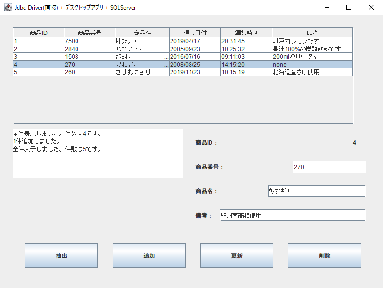

## :computer: SwingでJDBC Driverを使いSQLServerとの読み書きサンプル  
___
### 環境
```
開発環境：Eclipse 2020-12 R(4.18.0) Pleiades  
言語：Java 11  
デスクトップ：Swing
デベロッパーSDK：Adopt OpenJDK 11.0.10 + 9  
データベース：Microsoft SQLServer 2019 Express CU9  
-データベース管理ツール：Microsoft SQL Server Management Studio 18.8
データベース接続：Microsoft JDBC Driver 9.2.0 for SQL Server  
```

  

## 事前準備  
### サンプルプログラムを実行する際のデータベース作成  
Microsoft SQL Server Management Studioのクエリーで以下を実行するかこれ相当をデザイナで作成します。  

#### データベース作成(Microsoft SQL Server ManagementStudioでのデフォルト相当)  
※Microsoft SQL Server 2019 Express Editionで名前付きインスタンスが`SQLEXPRESS`の場合のクエリーです。  
別のインスタンス名やSQL Server 2017などのバージョンの場合はPathの**MSSQL15.SQLEXPRESS(ディレクトリ名)**  
が違いますのでご自身のディレクトリ名に合わせて下さい。  
```
use [master]
CREATE DATABASE JdbcSample
ON
(NAME=JdbcSample,FILENAME='C:\Program Files\Microsoft SQL Server\MSSQL15.SQLEXPRESS\MSSQL\DATA\JdbcSample.mdf',SIZE=8MB,FILEGROWTH=64MB)
LOG ON
(NAME=JdbcSample_log,FILENAME='C:\Program Files\Microsoft SQL Server\MSSQL15.SQLEXPRESS\MSSQL\DATA\JdbcSample_log.ldf',SIZE=8MB,FILEGROWTH=64MB)
	
ALTER DATABASE JdbcSample SET AUTO_CLOSE OFF
```

#### テーブル作成  
```
use [master]
create table [JdbcSample].[dbo].[ShohinDataDesk] (
	NumId int NOT NULL IDENTITY(1,1),	/*自動連番*/
	ShohinNum smallint NOT NULL,		/*商品番号*/
	ShohinName char(50),			/*商品名*/
	EditDate decimal(8,0) NOT NULL,		/*編集日付*/
	EditTime decimal(6,0) NOT NULL,		/*編集時刻*/
	Note varchar(255),			/*備考*/
	primary key (NumId))
```

#### サンプルデータ追加  

```
use [master]
insert into [JdbcSample].[dbo].[ShohinDataDesk]
	(ShohinNum, ShohinName, EditDate, EditTime, Note) values
	(7500,'ｾﾄｳﾁﾚﾓﾝ',20190417,203145,'瀬戸内レモンです')
insert into [JdbcSample].[dbo].[ShohinDataDesk]
	(ShohinNum, ShohinName, EditDate, EditTime, Note) values
	(2840,'ﾘﾝｺﾞｼﾞｭｰｽ',20050923,102532,'果汁100%の炭酸飲料です')
insert into [JdbcSample].[dbo].[ShohinDataDesk]
	(ShohinNum, ShohinName, EditDate, EditTime, Note) values
	(1508,'ｶﾌｪｵﾚ',20160716,91103,'200ml増量中')
insert into [JdbcSample].[dbo].[ShohinDataDesk]
	(ShohinNum, ShohinName, EditDate, EditTime, Note) values
	(270,'ｳﾒｵﾆｷﾞﾘ',20080825,141520,'none')
```

#### SQL Server Configuration Manager  
SQL Server Browserの実行とTCP/IPの有効を適用して下さい。  

___